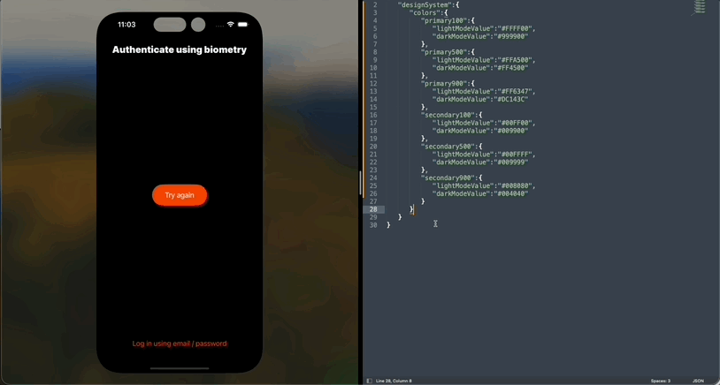

# A cross-modular, synamic app styling POC

This application is a showcase, demonstrating the concept of dynamically updating the style of a modular, white-label iOS app. It leverages an approach showcased in https://www.swiftystack.com/, adjusted to better suit white-label application.  Here are the key requirements to evaluate the proposed architecture:

- Interchangeability - The ability to replace one module with another, provided they share the same contract (API compatibility).
- Testability - Each module, including the UI, should be testable. There should be an overarching test target that allows the execution of all tests within all modules.
- Encapsulation - Every critical app feature (e.g., onboarding, sign-up, etc) should be contained within a single `feature module` and designed to be developed in isolation.
- Minimum code duplication - As a white-label application, the app must accommodate multiple clients/brands using the same codebase. Ideally, the only code differentiating one branded app from another would be configuration and assets.
- Transparent communication - Features should communicate transparently with each other and the main app.

## Application overview
The application employs a modular design, managing three types of modules:

- `Common` modules - These modules contain commonly used tools, basic data structures, models, views, and so forth.
- `Utility` modules - These are more advanced and specialized modules responsible for specific tasks such as analytics, geo-fencing, and payments.
- `Feature` modules - These modules comprise a complete app feature, including the user interface and navigation.

One of the significant advantages of modular apps is the capability to develop app features separately. To facilitate this, the project provides several `Demo apps`. These are essentially containers that embed a specific feature. A notable example of such an app is the `Playbook` demo, which allows for the adjustment of basic UI components' styling, such as buttons, texts, text fields, and so on.

## Technologies, frameworks and tools

The app utilizes the following technologies, frameworks, and utilities:

- [Sourcery](https://github.com/krzysztofzablocki/Sourcery) - Used to generate style descriptors for `Playbook` and create fake test objects in tests.
- [Playbook](https://github.com/playbook-ui/playbook-ios) - Enables the preview and adjustment of basic UI component styling.
- [Swift Snapshot Testing](https://github.com/pointfreeco/swift-snapshot-testing) - Allows the testing of UI components in various states and brandings.
- [Inject](https://github.com/krzysztofzablocki/Inject) - Enables hot reloading when working with SwiftUI views.
- [NG iOS Network Module](https://github.com/netguru/ng-ios-network-module) - Used to abstract the networking layer.

## Installation

- Install [Sourcery](https://github.com/krzysztofzablocki/Sourcery).
- Run Sourcery to generate any missing code from templates.
- Open `DynamicStylingPOC.xcworkspace` in Xcode 15 or later.
- Use the `DynamicStylingPOC` scheme to run the app or all project tests.
- Use the `PlaybookApp` scheme to run the Playbook app.
- Use one of the other app schemes (for example, `DemoApp-Onboarding`) to run a specific demo app.

## Testing the Dynamic Styling function:

- Navigate to the `Other Files` folder and find the `styles.json` file. Modify the style tokens as necessary.
- Place the file on a publically accessible remote server, such as One Drive.
- Open `FetchStylesUpdateRequest` and replace the default style update file path with your own.
- Start the main app.
- Shake the device to initiate a style update.
- If there are any problems with the style update, debug `AppStyleSynchroniser`.